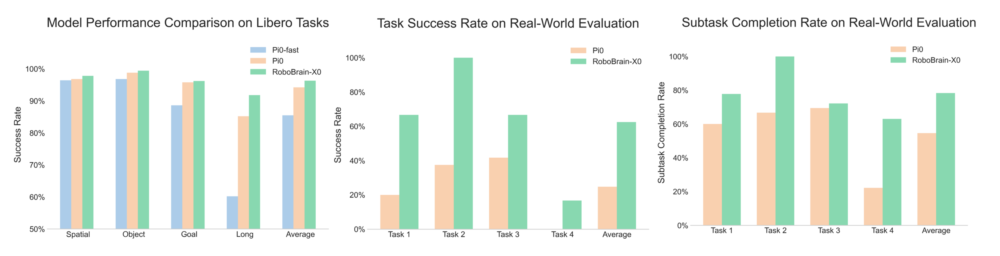

<div align="center">

</div>

# RoboBrain-X0: A Unified Cross-Embodiment Vision-Language-Action Model for Token Reasoning and Action Generation. 


<p align="center">
        </a>&nbsp&nbsp⭐️ <a href="https://superrobobrain.github.io/">Project</a></a>&nbsp&nbsp | &nbsp&nbsp🤗 <a href="https://huggingface.co/BAAI/RoboBrain-X0-Preview">Hugging Face</a>&nbsp&nbsp | &nbsp&nbsp🤖 <a href="https://www.modelscope.cn/models/BAAI/RoboBrain2.0-7B/files/">ModelScope</a>&nbsp&nbsp 

<!-- </p>
<p align="center">
        </a>&nbsp&nbsp📖 <a href="https://wisemodel.cn/models/BAAI/RoboBrain2.0-7B">Wisemodel</a>&nbsp&nbsp | &nbsp&nbsp📑 <a href="https://arxiv.org/abs/2507.02029 ">Technical Report</a>&nbsp&nbsp | &nbsp&nbsp💬 <a href="./assets/wechat.jpeg">WeChat & RedNote</a>
</p> -->

</p>

<p align="center">
</a>&nbsp&nbsp🚀 <a href="https://github.com/FlagOpen/RoboBrain2.0">RoboBrain 2.0</a>: See Better. Think Harder. Do Smarter. 
</p>
<p align="center">
        </a>&nbsp&nbsp🎯 <a href="https://flagopen.github.io/RoboOS/">RoboOS</a>: An Efficient Open-Source Multi-Robot Coordination System for RoboBrain.
</p>
<p align="center">
</a>&nbsp&nbsp⭐️ <a href="https://github.com/tanhuajie/Reason-RFT">Reason-RFT</a>: Core Post-Training Strategy for Embodied Visual Reasoning in RoboBrain2.0.
</p>
<p align="center">
</a>&nbsp&nbsp🌍 <a href="https://github.com/FlagOpen/RoboBrain">RoboBrain 1.0</a>: A Unified Brain Model for Robotic Manipulation from Abstract to Concrete.
</p>

💬 ***If you have any questions, feel free to contact us via WeChat or RedNote.***

<div align="center">

</div>

## 🔥 Overview
We are thrilled to introduce **RoboBrain-X0**, a groundbreaking cross-ontology foundation model designed to overcome the limitations of single-robot systems in heterogeneous ontology transfer. By leveraging End-Effector pose representation in SE(3) task space, coupled with a Unified Action Vocabulary (UAV) and action tokenizer, RoboBrain-X0 achieves efficient **zero-shot** generalization and **complex task decomposition**. Its Grouped Residual Quantizer (GRVQ) maps continuous control sequences from diverse degrees of freedom and mechanical structures to a shared discrete action primitive space, ensuring semantic consistency and transferability across ontologies such as **AgileX**, **R1-Lite dual-arm wheeled robots**, and **Franka single-arm systems**. Through ontology-conditioned diverse prompting, the model supports flexible decoding from multi-view RGB-D inputs to specific executions, significantly reducing training and inference overhead. RoboBrain-X0 delivers state-of-the-art performance in embodied reasoning tasks, laying a robust foundation for developing versatile, real-world robotic agents and advancing embodied intelligence research.


<div style="display: flex; justify-content: center;">
  
</div>


## 🗞️ News
- **`2025-09-29`**: 🔥 [**RoboBrain-X0-preview**](https://huggingface.co/BAAI/RoboBrain-X0-Preview) was released.


## 📆 Todo
- [x] Release model checkpoint for RoboBrain-X0-Preview
- [ ] Release quick inference example for RoboBrain-X0
- [ ] Release training and evaluation codes for RoboBrain-X0


## 🚀 Features
**RoboBrain-X0** supports the unified modeling of heterogeneous ontologies and offers zero-shot generalization and complex task decomposition capabilities. Building on RoboBrain's multimodal foundation, RoboBrain-X0 further integrates real-world robot motion data based on RoboBrain-2.0 data. By unifying vision, language, and motion modeling, it achieves cross-ontology generalization and adaptation, providing integrated capabilities from perception to execution.


## ⭐️ Architecture
This model includes **RoboBrain 2.0** and **OmniSAT** (action tokenizer). Based on RoboBrain 2.0, the model is trained on a large amount of real-world robotics data and embodied reasoning data, enabling it to possess general robotic manipulation capabilities. The action token sequences output by the model are converted into underlying robot control signals through our proprietary action tokenizer. Model details are as follows:
- **Multimodal Input**: The model accepts single-image, multi-image, and text input (covering pointing task scenarios, object maneuverability scenarios, trajectory scenarios, and subtask execution scenarios), and produces outputs of varying dimensions based on the input scenarios.
- **Action Generation and Execution**: After model processing, OmniSAT converts these into multi-degree-of-freedom (DoF) action sequences, ultimately driving the robot to complete the operation.

<div align="center">
      
</div>


## 🤗 Model Zoo


| Models               | Checkpoint                                                     | Description                                                | 
|----------------------|----------------------------------------------------------------|------------------------------------------------------------|
| RoboBrain-X0-preview     | [🤗 BAAI/RoboBrain-X0-Preview](https://huggingface.co/BAAI/RoboBrain-X0-Preview)  | preview version of the RoboBrain-X0                  | 


## 🛠️ Setup

```bash
# Pull Docker Image.
docker pull ghcr.io/robobrain-roboos-robotic/robotics_pretrain_flagscale:cuda12.4.1-cudnn9.5.0-python3.12-torch2.6.0-time250928-ssh

# Run Container.
docker run -itd \
  --name robotics_pretrain \
  --privileged \
  --gpus all \
  --net=host \
  --ipc=host \
  --device=/dev/infiniband \
  --shm-size 512g \
  --ulimit memlock=-1 \
  -v /nfs/hcr/models/:/models \
  ghcr.io/robobrain-roboos-robotic/robotics_pretrain_flagscale:cuda12.4.1-cudnn9.5.0-python3.12-torch2.6.0-time250928-ssh
```


## 💡 Simple Inference

## 🤖 Training
```bash
cd /root/robotics_pretrain/flag-scale
conda activate flagscale-train

python run.py \
  --config-path ./examples/qwen2_5_vl/conf \
  --config-name train_3b_action_S6_subtask_agilex_eval5_demo \
  action=run
```

## 🔍 Evaluation


## 📑 Citation
If you find this project useful, welcome to cite us.
```bib
@article{RoboBrain1.0,
    title={Robobrain: A unified brain model for robotic manipulation from abstract to concrete},
    author={Ji, Yuheng and Tan, Huajie and Shi, Jiayu and Hao, Xiaoshuai and Zhang, Yuan and Zhang, Hengyuan and Wang, Pengwei and Zhao, Mengdi and Mu, Yao and An, Pengju and others},
    journal={arXiv preprint arXiv:2502.21257},
    year={2025}
}

@article{RoboBrain2.0TechnicalReport,
    title={RoboBrain 2.0 Technical Report},
    author={BAAI RoboBrain Team},
    journal={arXiv preprint arXiv:2507.02029},
    year={2025}
}

@article{zhou2025roborefer,
    title={RoboRefer: Towards Spatial Referring with Reasoning in Vision-Language Models for Robotics},
    author={Zhou, Enshen and An, Jingkun and Chi, Cheng and Han, Yi and Rong, Shanyu and Zhang, Chi and Wang, Pengwei and Wang, Zhongyuan and Huang, Tiejun and Sheng, Lu and others},
    journal={arXiv preprint arXiv:2506.04308},
    year={2025}
}

@article{Reason-RFT,
    title={Reason-rft: Reinforcement fine-tuning for visual reasoning},
    author={Tan, Huajie and Ji, Yuheng and Hao, Xiaoshuai and Lin, Minglan and Wang, Pengwei and Wang, Zhongyuan and Zhang, Shanghang},
    journal={arXiv preprint arXiv:2503.20752},
    year={2025}
}

```


